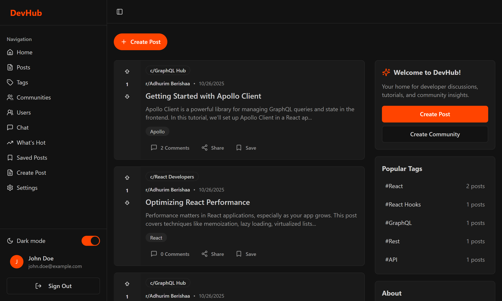

# DevHub — Explore Different Blogs



A full-stack developer community platform for sharing knowledge, discussing technologies, and connecting with fellow developers. Similar to Reddit or Dev.to, DevHub enables developers to create posts, share tutorials, ask questions, showcase projects, and engage with the community through comments, votes, and real-time messaging

## Features

- User authentication and profiles — Secure registration/login with JWT authentication, customizable profiles with avatars
- Posts and content — Create posts with images, tags, and rich text; publish or save as drafts
- Voting system — Upvote/downvote posts and comments
- Comments and discussions — Nested comment threads with replies
- Tags — Organize content with tags; discover trending topics
- Communities — Create and join topic-specific communities

## Tech Stack

**Frontend:**

- React
- Zustand for global state management
- Tailwind CSS for UI styling
- Socket.IO Client for real-time chat

**Backend:**

- Node.js with Express.js
- GraphQL (Apollo Server 5)
- Prisma ORM with PostgreSQL
- Socket.IO for real-time features

## Installation

1. Clone the repository

   ```bash
   git clone https://github.com/AdhurimBerisha/Study-Buddy.git
   ```

2. Install dependencies for frontend and backend

   ```bash
   cd frontend
   npm install

   cd backend
   npm install
   ```

3. Set up environment variables (see below)

## Environment Variables

This project requires a few environment variables to run properly.

- For the **backend**, create a `.env` file.

### backend `.env` variables include:

- `DATABASE_URL` — your_database_url
- `CLOUDINARY_CLOUD_NAME` — your_cloudinary_cloud_name
- `CLOUDINARY_API_KEY` — your_api_key
- `CLOUDINARY_SECRET_KEY` — your_api_secret
- `JWT_SECRET` — your_jwt_secret

4. Run the development servers

   ```bash
   # Backend
   npm run dev

   # Frontend
   npm run dev
   ```
